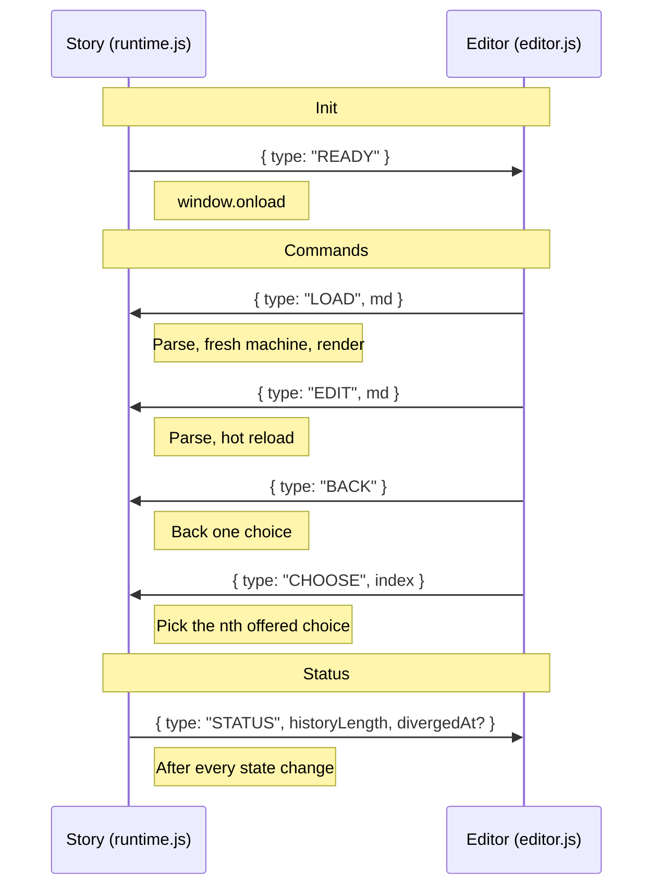

- [Fable User Guide](#fable-user-guide)
  - [Working with Fable](#working-with-fable)
  - [Language Reference](#language-reference)
    - [Prose](#prose)
    - [Sections](#sections)
    - [Code and Interpolations](#code-and-interpolations)
    - [Jumps and Tunnels](#jumps-and-tunnels)
    - [Choices](#choices)
    - [Breaks and Spaces](#breaks-and-spaces)
    - [Links](#links)
    - [Semantics](#semantics)
  - [Runtime](#runtime)
    - [Story APIs](#story-apis)
    - [Browser APIs](#browser-apis)
    - [How code is run](#how-code-is-run)
    - [Saving and loading](#saving-and-loading)
  - [CLI](#cli)
    - [Exporting a standalone HTML page](#exporting-a-standalone-html-page)
    - [Writing](#writing)
    - [Visualising a story](#visualising-a-story)
    - [Expect tests](#expect-tests)
    - [Random testing](#random-testing)
  - [Design](#design)
  - [Other systems](#other-systems)
- [Development](#development)
  - [Getting started](#getting-started)
  - [Compiler and Runtime](#compiler-and-runtime)
  - [Editor](#editor)
    - [Restarting](#restarting)

# Fable User Guide

## Working with Fable

Fable consists of a browser-based [editor](https://dariusf.github.io/fable/), a CLI tool, and a library (Fabula).

- The editor is the most accessible way to get started. However, as it runs completely client-side, the only durable way to save your story is by encoding it in a URL. While works in theory[^url], you'll want to save longer stories manually. The editor also does not provide a way to package a story as a HTML file for deployment to e.g. itch.
- To do that, you'll want at some point to write your story in a text editor, and use a build script to invoke the CLI tool.
- The library, Fabula, is mostly intended for internal use in the above two frontends. Let me know your use cases for it.

[^url]: The maximum length of a URL [varies a lot across browsers](https://stackoverflow.com/questions/417142/what-is-the-maximum-length-of-a-url-in-different-browsers), but modern browsers either do not limit it or have absurdly high limits. For comparison, The Lord of the Rings is 3MB of text, so you could in theory write that entirely on an iPhone in Safari.

## Language Reference

Fable is a Markdown dialect for writing choice-based interactive fiction.

This section informally specifies the language. For a friendlier introduction, see the [tutorial](https://dariusf.github.io/fable/).

### Prose

Like other narrative scripting languages, unadorned text is prose to be shown to the player.

_Meta_ things (e.g. code, choices) are quoted using backticks, or represented using typographic elements which wouldn't normally appear in prose (e.g. lists).
Meta elements which have imperative effects are called _instructions_.

<!-- Interactivity may be expressed using _instructions_, where are represented using Markdown elements. -->

### Sections

A Fable _story_ consists of named _sections_, which contain paragraphs of prose and instructions.

<!-- Why not call them scenes? a scene is a reader-level concept that may span multiple sections (an author-level concept). jumping between sections is completely transparent and does not necessarily map to a change of scene -->

Sections are named using Markdown headings, and are shown until they end or are interrupted (e.g. by a jump or choice). A section may never be shown in its entirety.

Content before first section goes into an implicit section named `prelude`.  The story starts there or at the first section.

### Code and Interpolations

Code can be freely interleaved with prose in Fable.

Inline code `` `CODE` `` is executed when encountered (details [here](#how-code-is-run)). Its output is hidden. Code blocks (with an optional language declaration) can be used for longer snippets.

    ```js
    CODE
    ```
A _prefix_ can be used to access variations of this.

With a `$` prefix (e.g. `` `$CODE` ``), the output is _interpolated_ as _text_ into the story at that point.

With a `~` prefix, the output is interpolated as _Fable_ into the story at that point.
This allows _unquoting_: generating some fragment of story dynamically using JavaScript.

The block form of this uses the `meta` or `~` info-string after the language type.

    ```js ~
    CODE
    ```

<details>
<summary>What fragment of Fable is allowed in interpolations?</summary>

Meta-Fable is restricted in a number of ways:

- New sections will not persist. They also cannot be jumped to. Only the prelude is useful, essentially.
- `more` cannot refer to sections outside the interpolation.
- Inline interpolations only use the first paragraph. They can't produce choices or other blocks.
- Frontmatter is not parsed. `---` is a hr or a heading/section, depending on where it appears.

Some of these restrictions are arbitrary and only for ease of implementation.
They may be relaxed in future if the need arises.

</details>

The [runtime docs](#runtime) have the details of what APIs are available.

### Jumps and Tunnels

_Jumps_ connect sections.
They may occur anywhere in prose:
as part of the flow of a section (in which case the section seamlessly ends and another begins), or in response to player input (via choices).

Jumps are represented as inline code with special prefixes.

A `jump` or `->` (e.g. `` `jump SECTION` `` or `` `->SECTION` ``) prefix denotes a jump to SECTION.
An empty SECTION is shorthand for the current section.

A _dynamic jump_ `->$` prefix jumps to the name of the section that its content evaluates to.

A `tunnel` or `>->` prefix denotes a _tunnel_ to a named section, which returns to the origin of the jump after the destination section completes.

### Choices

Lists denote choices. Each choice item is typically of the form ``TEXT `CODE` BODY``.

- TEXT will be shown to the player, as the clickable text of that item.
- CODE is some fragment of code that will be run when the choice is selected. Its result is not shown.
- BODY is some Fable fragment that will be executed only if the item is chosen.

The section *continues* after a choice, like [Ink's weave](https://github.com/inkle/ink/blob/master/Documentation/WritingWithInk.md#the-weave-philosophy). This is the default, unlike in Ink.

**Loose lists.** Like in Markdown, lists can be loose, with blank lines between items. This is useful if items have a significant body.

**No code.** CODE can be left empty `` ` ` ``, in which case it functions as a divider between what is shown before and on selection. It can also be replaced with a single line break.

**Nested choices.** Indenting the body so that it lines up with the text of the bullet (Markdown-style) allows it to contain other elements, allowing nested choices.

<!-- https://spec.commonmark.org/0.31.2/#list-items -->

**Preconditions.** Each choice item may have a _precondition_ `` `guard CODE` `` or `` `?CODE` ``, preceding the item text. The item will then be shown only if CODE evaluates to a truthy value.

**Persistence.** By default, each item in the choice can only be selected once: after selecting an item, if control later returns to the section the choice was in, the item cannot be selected again.
This can be changed by starting the choice text with `` `sticky` ``, making the choice _persistent_.
Whether a choice is persistent is independent of whether it has a precondition.

**Inlined choices.** A choice may have items consisting only of `` `more SECTION` ``, where SECTION is expected to have a single choice in it; the options of that choice will then be inlined transparently into the current choice.
This may happen recursively.
Such items may have preconditions, in which case they apply to every inlined item.

**Fallback.** A fallback choice can be given by starting the choice text with `` `otherwise` ``. It will then be shown only if no other choices are available.
Persistent choices are incompatible with fallback choices, as then the fallback choices will never be taken.

**Empty choices and fallthrough.**
Empty choices may arise due to incomplete preconditions, or choices being exhausted without an `otherwise` clause.
They _get stuck_, rather than continuing with whatever is after, since the reader has not selected anything.
To instead continue with whatever is after the choice, add `` `fallthrough` `` in an item (which will otherwise be ignored).
This is also incompatible with `` `otherwise` ``.

### Breaks and Spaces

Like in Markdown, double linebreaks delimit paragraphs, and single linebreaks are turned into spaces.

Spaces are inserted between inline elements according to the _spacing rules_.

1. By default, a space is inserted between adjacent elements.

   ```markdown
   You have `$n` coins.
   ```

   where n = 3 produces

   ```
   You have 3 coins.
   ```

2. Punctuation and closing quotes attach to the previous word.

   ```markdown
   Very `$status`!
   ```

   where status = "good" produces

   ```
   Very good!
   ```

3. Opening quotes attach to the next word.
   <!-- A trailing quote suppresses the next space. -->

   ```markdown
   "`$suspect` did it!"
   ```

   where suspect = "Bob" produces

   ```
   "Bob did it!"
   ```

4. Textless elements are transparent.

   ```markdown
   before $x after
   ```

   where x = "" produces

   ```
   before after
   ```

5. Spacing uses visible text.

   ```markdown
   some <b>bold</b> text
   ```

   produces

   ```
   some bold text
   ```

6. Containers are spaced on their own.

   ```markdown
   very *important, truly* so.
   ```

   produces

   ```
   very important, truly so.
   ```

   Inside an emph, there will be no space just after the opening delimiter. Space before the emph belongs to its parent.

   The same applies to links.

   ```markdown
   see [here](#start).
   ```

   ```
   see here.
   ```

   (Rule 2 applies here too.)

<!-- A minor extension is the quoted semicolon `` `;` ``.
This acts as a paragraph break wherever it appears, i.e. the equivalent of two newlines, followed by matching the indentation of the context.
This is especially useful in places where paragraph breaks are frequent but cumbersome, e.g. dialogue inside a choice item, where paragraphs are used to signal new speakers.
For block-level things like nested choices, indentation is preferable.

The quoted semicolon is used for putting paragraph breaks between things like dialogue. For blocks, nested choices indent is better -->

### Links

> [!WARNING]
> Unstable; may change!

Links allow input outside the usual flow of choices.

A `[TEXT](#SECTION)` link jumps to SECTION.

<!-- TODO disable other choices -->

A `[TEXT](!FN)` link causes the function FN to be executed.

Links are currently not part of history, and so are not replayed.

Links currently persist forever.

### Semantics

A Fable story can be given a (denotational) semantics as a procedural program.

| Fable          | Program         |
| -------------- | --------------- |
| section        | labelled block  |
| prose          | print statement |
| code           | statements      |
| interpolations | expressions     |
| choice         | conditional     |
| jump           | goto            |
| tunnel         | procedure call  |
| meta           | unquote/eval    |

The abstraction provided by Fable is intentionally leaky.
This has several benefits.
The story can be reasoned about and tested like a program.
It's clear when a particular bit of prose "executes", allowing things like raw HTML widgets appearing within the flow of a story.
The browser console is fully available, and the state of the story can be queried at any point without doing anything special.
Necessary data structures, libraries, and language features can be used without any fanfare.

## Runtime

The runtime system supports the execution of Fable stories.
It provides APIs to manipulate [stories](runtime.js) as well as their execution in [the browser](main_browser.js).
The former are typically used when writing stories, while the latter are for writing code for the games supporting stories.
Direct console access to both is supported.

All other parts of the runtime not mentioned below are considered unstable.

### Story APIs

- `local`: section-local state, may be mutated; initialise at the top of a section using
    ````markdown
    # My Section

    ```js
    local.x ||= 0
    ```
    ````
- `seen.SECTION`: the number of times SECTION has been seen; can be used in a truthy manner
- `turns_since(SECTION)`: turns elapsed since SECTION was last visited
- `last_choice()`: label of the most recent choice made
- Replay-safe randomness: `random()`, `randomFrom(xs)`, `coin()`, `randomIncl(lo, hi)`, `randomExcl(lo, hi)`
- `clickAll(...labels)`: take a sequence of choices by label
- Builders for Fable fragments in interpolations: `jump(label)`, `tunnel(label)`

<!-- - `randomly_test()`: play the story by making random choices until it ends or gets stuck -->

<!-- `stop_testing` didn't survive rewrite -->

<!-- All other parts of the runtime are considered unstable and not part of the API. -->

<!--
|                           | Deprecated                     | Replacement |
| ------------------------- | ------------------------------ |
| `internal.turns`          | `machine().turns()`            |
| `internal.current_scene`  | `machine().currentScene()`     |
| `internal.choice_history` | `machine().history()`          |
| `internal.scenes`         | none yet (runtime-owned state) |
| `internal.section_state`  | `local` within a section       |
-->

<!-- - `internal`: internal state of the runtime system -->
<!-- - `internal.bug_detectors`: push oracles in here -->
<!-- - `internal.history_interpretations`: push functions of type `(string) => boolean`. They should return true (and perform side effects) to indicate that an ad hoc history item is handled upon hot reload
    - Hooks: these are lists of callbacks, typically of type `() => void`; exceptions are noted
      - `internal.on_scene_visit`
      - `internal.on_interact`: called at some point when a choice is made
      - `pre_push_history`: called before a choice history item is pushed; may be used to add ad hoc history items, whose meaning can then be defined using `history_interpretations`. Return `true` to make the callback one-shot.
- `clear()`: clears the page
- `jump(label)`, `tunnel(label)`: builders for Fable fragments which may help reduce the amount of quoting required -->

### Browser APIs

<!-- - `putValueInSelect(id, val)`: set the value of a `<select>` element by id. For restoring widget state. Browser only -->
<!-- - `enableResetDetector(elt, reset)`: tap the element 5 times in 2 seconds to prompt for a game reset, then call `reset`. An escape hatch for corrupt saves. Browser only -->
- `smartypants(str)`: smart quotes, dashes, ellipses; use when generating text into raw HTML
- `smartypantsHtml(html)`: `smartypants` for raw HTML, transforming only text between tags
- `chooseNth(n)`: click the nth offered choice, as the digit keys do
<!-- - `isStandalone()`: true in a published page or on itch; false in the editor -->
<!-- - `isInDev()`: true on localhost or a `file:` page -->
<!-- - `isDeterministic()`: true under test automation or with `?det=1`. The seed is fixed to 1 -->

<!-- - `choices_disappear`: if true (default), a choice list is removed after a choice is taken. If false, the choices remain but are de-linked -->

<!-- - `?reset=1` — clear the saved game and start over. The value must be exactly `1`. An
  escape hatch for corrupt saves; also skips loading any other save source this run.
  - `?choices=a|b|c` — start from a given history: the listed choice labels, separated by
  `|`, are replayed at load. Overrides the localStorage save without deleting it.
  Carries no seed, so random draws are not reproduced from the original session.
  - `?det=1` — deterministic mode: a fresh session starts with seed 1 instead of a random
  seed. Any non-empty value works, and test automation (`navigator.webdriver`) enables
  it without the parameter. A saved seed still takes precedence; combine with `reset=1`
  for a fully reproducible run. -->

### How code is run

Code is evaluated using [indirect `eval`](https://developer.mozilla.org/en-US/docs/Web/JavaScript/Reference/Global_Objects/eval#direct_and_indirect_eval), which means:

- It runs in the global scope and cannot access local variables.
- Local variables (from `let` and `const`) are effectively scoped to each code block or backticked span.
- Any programming which involves story-wide state should be done with global variables, either by assigning to `window`, using `var`, or assigning to a variable without a prior declaration.
    - This enables the use of the browser devtools to inspect or modify story state.
    - By convention, user state is in `window.state`.

### Saving and loading

By default, Fable persists reader choices in local storage.
In short, if you don't do anything, your game will behave reasonably when the page is reloaded.
Caveats below.

It's advisable to at least set `local_storage_key`, so multiple games don't clobber each other's data.

```js
// define this on window, as it must run before the game is started;
// Fable calls it automatically
function beforeGameLoad() {
  internal.local_storage_key += ".your-game"; // advised

  // optional
  internal.local_storage_version = 1; // the default
  internal.on_game_load.push((data, _version) => {
    state.your_data = data.your_data ?? 0;
  });
  internal.on_game_save = () => ({ your_data: do_something() });
}
```

<!-- TODO note that Fable's own data (choice-history) is not versioned -->

The rest is for persisting user-defined data.

- Save data can optionally be versioned, to give the option of invalidating or migrating old save data.
- When Fable wants to save data, it will call `on_game_save`, where you can supply what data should be saved.
- When Fable wants to load data, it will call all the functions in `on_game_load`, passing the data you saved, as well as the version.

Caveats:

- **Race conditions** If your game is open in multiple tabs, the last one the user takes an action in will have its data saved
- **When does saving/loading occur?** You generally shouldn't rely on this, but in case, saving currently happens after interactions, and loading happens before the game starts or when the back button is pressed. If the user closes the tab or switches app and never returns, nothing will saved.
- **Escape hatches** In case something goes wrong with the save data (data corruption, bug), the game could become unable to start, depending on how you're handling it. To mitigate this, there are two escape hatches:
  1. The query parameter `?reset=1` can be appended to the URL. This is your means of ensuring a reader's game has its state reset.
  2. An escape hatch can be placed on text in the game like this:

    ```html
    <span class="reset-button">some text</span>
    ```

    ```js
    enableResetDetector(document.querySelector(".reset-button"))
    ```

    Tapping it 5 times in 2 seconds will prompt the user for confirmation on whether they want to reset.

- **Divergence** Persisting the reader's game state *just works* by saving their history of choices and playing through the entire sequence on reload. However, what happens if you remove or reword some of those choices? This is called *divergence* from the previous history; when it happens, the game will just stop at the point of divergence. This is a reasonable, best-effort default, in that it seems better than starting over completely. It also goes through the hot reloading flow so it's well-tested. The tradeoff is that it may leave the player somewhere odd, so it may appear like a glitch. However, it will be at a point they reached through their own choices.
- The save file will not be versioned. if it's invalid, i'll just throw it away and not attempt to migrate it. or write code to migrate and never break old fields.
- **Guarantees on persistence** Unfortunately there are no guarantees on how long saved data will be persisted; it varies a lot across browsers, platforms, settings, and *time*. It is best to assume that the saved data is transient: it survives refreshes, but you probably shouldn't rely on it surviving beyond a few days. As of the time of writing, it works this way on itch in mobile and desktop browsers.
  - It has historically not worked at all on mobile Safari and itch
  - It appears to work now, but I've seen reports that the data is cleared after 7 days, as well as upon killing the browser app

<!-- - different browsers remove the save at different times. safari apparently does it when the app is killed, or in 7 days. who knows -->


<!--
Apr 2026 ios safari itch loses save data on quit
https://intfiction.org/t/local-storage-clears-on-mobile-browsers-deleting-saved-games/74647/5
https://intfiction.org/t/playing-bee-itch-io-on-iphone-browser-game-progress-lost-w-autorefresh/74407/3

how twine sugarcube works. 1-7 days, depends on settings
https://old.reddit.com/r/twinegames/comments/pmh9d7/itchio_wont_retain_save_data_twine_sugarcube/
-->


## CLI

### Exporting a standalone HTML page

```sh
fable -s examples/crime.md -o _build
open _build/index.html

# add other files to _build before deploying, e.g. to itch
cd _build
zip -r game.zip *
butler push game.zip $USER/$GAME:html5
```
<!--
### Compiling a Fable story

```sh
fable examples/crime.md > story.js
```
-->

### Writing

A script (call it `write.sh`) for a nice offline writing setup with live reloading.

```sh
#!/usr/bin/env bash

build() {
  fable -s story.md -o _build
}

if [ -z $1 ]; then
  vite _build &

  # kill child processes on interrupt
  procs="$(jobs -p | tr '\n' ' ')"
  trap "kill $procs" 2

  git ls | entr -ccr ./write.sh build
else
  "$1"
fi
```

### Visualising a story

When building in standalone mode, `graph.dot` and `graph.mmd` are written to the build directory. They can be rendered using Graphviz and Mermaid.

```sh
# Most package managers have Graphviz
dot -Tsvg -o _build/graph.svg _build/graph.dot

# npm install -g @mermaid-js/mermaid-cli
mmdc -i _build/graph.mmd -o _build/graph-mm.svg
```

Because of Fable's expressiveness and dynamic nature, it is not possible to show a perfectly accurate graph, so the output is a best-effort overapproximation. Dotted edges indicate dynamic edges, indicating that it *may be possible* to jump between the connected sections. Following these rules of thumb will help produce a more accurate graph:

- If you only use `` `->SCENE` `` to jump, the output will be completely accurate.
- If you jump dynamically, avoid dynamically constructing section names. Instead, invoke `jump` directly on constant section names, and put those in branches. That will produce accurate dotted edges.

### Expect tests

When writing an extensive story, it's very useful to guard against regressions by recording the result of a playthrough and comparing it against what you get in subsequent versions.

First, generate your story with tests.

```sh
fable -s examples/crime.md -o _build -t
```

This will produce a minimal dune project in the build directory with [cram](https://dune.readthedocs.io/en/stable/reference/dune/cram.html) tests set up.

Next, add your tests.

```sh
code tests.t # first time
cp tests.t _build # subsequent times
```

`tests.t` should be a cram test file which invokes the `test.js` script, passing it a sequence of choices to execute against the story. Example:

```cram
  $ node test.js /abs/path/to/index.html 'Go to Scene 1' 'Apple'
```

Finally, invoke `dune test` in the build directory.

```sh
# npm i -g playwright
# npm i -g @playwright/browser-chromium
cd _build
npm link playwright
dune test

# if anything changes
dune promote && cp tests.t ..
```

This will play through your story headlessly using Playwright and output the raw HTML of the resulting page to the test file.

You can then `promote` the output out of the build directory, so you have a record of how the choices played out to compare against in future.

The simplest way to make Playwright available is to install it globally and link it into the build directory right before running the tests.

### Random testing

Standalone stories can be tested randomly in the browser by evaluating `randomly_test()` in the console.

The default oracle looks for unhandled exceptions.
Custom testing oracles can be added by pushing functions which return `true` on error into `internal.bug_detectors`.

To stop, remove the URL hash property or evaluate `stop_testing()` in the console.

## Design

Fable's design is guided by a number of desiderata:

- Web-first. The web is the only open mainstream platform, and also the most accessible one for casual players.
- First-class support for programming. Substantial stories will need a substantial amount of code. Rather than reinventing the programming language, we start with the most popular language, JavaScript.
- Future-proof. Stories are just Markdown text files. The Fable compiler is open source. The output is vanilla HTML/JS/CSS which can be immediately uploaded to e.g. itch.
- Interoperability with the existing ecosystem. The use of Markdown confers many advantages: editor extensions which provide e.g. folding, jumping to headings, syntax highlighting, etc. will just work (even if they can be specialised a little). Formatting, typesetting, escaping into HTML, etc. are all solved. Diagrams can be rendered with Graphviz or Mermaid.
- Lightweight. The pipeline is simple and minimal: a Markdown file is compiled into high-level instructions for a small runtime. The mental model is also simple: choice-based interface fiction where code blocks imperatively modify the page as they become visible. While a framework or game engine might be useful for larger projects or teams, for small, indie ones, this is the right balance.

## Other systems

Fable's closest relative is Ink.

Ink is a scripting language: it is interpreted at runtime by a separate game engine. In contrast, the Markdown file in which you write a Fable story is compiled into the actual game. Fable also only targets the web. These differences underlie many of the design decisions Fable makes:

- Ink defines its own scripting language, as it is engine-independent, whereas Fable just uses JavaScript.
- In Ink, you attach tags to bits of text and rely on the engine interpreting them the way you want, whereas in Fable you can directly evaluate code as part of the flow of the story to make something happen/appear in the game.
- Fable's authoring language is simpler and smaller. It is a Markdown dialect, so e.g. inline HTML can be used to tag things, there is already syntax for images, etc. It relies _unquoting_ to JavaScript to dynamically generate bits of Fable, compared to having special syntax for e.g. conditionals.

# Development

## Getting started

```sh
opam install --deps-only .
npm i -g playwright @playwright/browser-chromium prettier
```

## Compiler and Runtime

A Fable story is compiled into a map of sequences of instructions. Instructions are high-level and may be nested.

Instructions are executed by a yielding abstract [machine](fabula/machine.mli) with an explicit frame stack. Its output is a sequence of events, which are further [interpreted](runtime.js) to [render the story in a browser](main_browser.js).

## Editor

The editor can be used to share Fable stories, so it [sandboxes JS evaluation using an iframe](https://web.dev/articles/sandboxed-iframes#safely_sandboxing_eval).

It simulates hot reloading on edit by _restarting_ and replaying choices made since the last restart, stopping short if a choice can no longer be taken in a new version.

<details>

<summary>How the editor and a story communicate</summary>



</details>

### Restarting

How does a restart work, given that stories may have arbitrary, user-defined global state in the `window`?

A restart effectively (and apparently, naively) jumps back to the prelude. This is safe if stories are semantically _closed_, meaning that everything in them is defined before it is used, and definitions are idempotent[^2].

Stories which are not closed will contain undesirable executions which lead to use-before-definition crashes.

For example, this story isn't closed:

```md
- A `->A`
- B `->B`

# A

`var x = 1;` `->B`

# B

`$x`
```

There is the unsafe execution `[B]`, which results in a `ReferenceError: x is not defined`.
Restarting may produce the execution `[A, restart, B]`, which does not crash, even though it should.

<!--
Testing a story with restarting may be thought of testing a modified story where every section has an implicit choice which jumps back to the prelude.
Executions are now of infinite length and there will be some which don't correspond to any that the original story has.
The modified story is an abstraction of the original with strictly more executions.
Since a restart is a transition, the user loses the ability to truly restart in the sense of getting a new execution, so some executions become "hidden".
-->

Having crashes hidden like this may seem nasty, but...

1. The alternative of reloading the iframe on every edit is expensive
2. An easy way to ensure closure is to initialize all user-defined state with `var` in the prelude
3. Random testing (which reloads) can be used to check this closure property

Hence, we assume stories are closed and default to restarting.

<!--
### Reloading

A safe but slow alternative is to reload the iframe on every edit, relying on the browser's cache for efficiency.

1. On page load, nothing happens in the editor, as the iframe loads asynchronously
2. The iframe loads and posts a message to the editor saying it has loaded
3. The editor replies with the contents of the field
4. The iframe receives Markdown text, parses it, then interprets it, which may result in sandboxed JS evaluation
5. On edit, the iframe is reloaded, causing the process to start again from 2

This guarantees that hot reloading will not result in "spooky" executions (`[A, reload, B]` would crash), but transfers quite a bit of data. See the previous section for other reasons why this isn't the default.
-->

[^2]: A helpful analogy is the execution model of a REPL. If the same closed block of code is pasted every time, it should always execute the same way, as it only relies on definitions given in the block itself. Idempotency of definitions can be ensured by using `var`.
